Vehicle Price Prediction & Analysis Pipeline

This repository contains a comprehensive Python data pipeline that cleans vehicle listings data, conducts exploratory correlation analysis, handles multivariate anomalies, and optimizes a polynomial regression model to predict vehicle prices.

🛠️ Features

- Automated Data Cleaning: Handles missing values via smart structural drops, median imputation, and categorical placeholder fills.

- Feature Engineering: Standardizes numerical scales and transforms raw vehicle year metrics into dynamic asset age values.

- Outlier Detection: Implements robust Interquartile Range (IQR) filtering to remove extreme bivariate and univariate anomalies.

- Model Optimization: Evaluates high-degree polynomial pipelines using 5-fold Cross-Validation to eliminate overfitting trends.

📦 Required Dependencies

Ensure you have the following Python libraries installed before running the execution script:

	bashpip install numpy pandas matplotlib seaborn scikit-learn

🚀 Execution Workflow

1. Data Ingestion & Missing Value Matrix

- Loads the structural data source file from data/vehicles.csv.

- Drops unneeded database structural index strings (VIN, id).

- Calculates and visualizes null-value percentages across all columns.

2. Feature Transformations

- Calculates vehicle_age relative to the current calendar year.

- Applies a standard scalar (StandardScaler) to odometer and vehicle_age.

- Fills remaining empty data fields using structural medians and 'Unknown' flags.

3. Exploratory Heatmap Matrix

- Generates a Pearson correlation coefficient matrix.

- Identifies the feature tracking the strongest relationship to target market price.

- Outputs a visual Seaborn correlation matrix heatmap graphic.

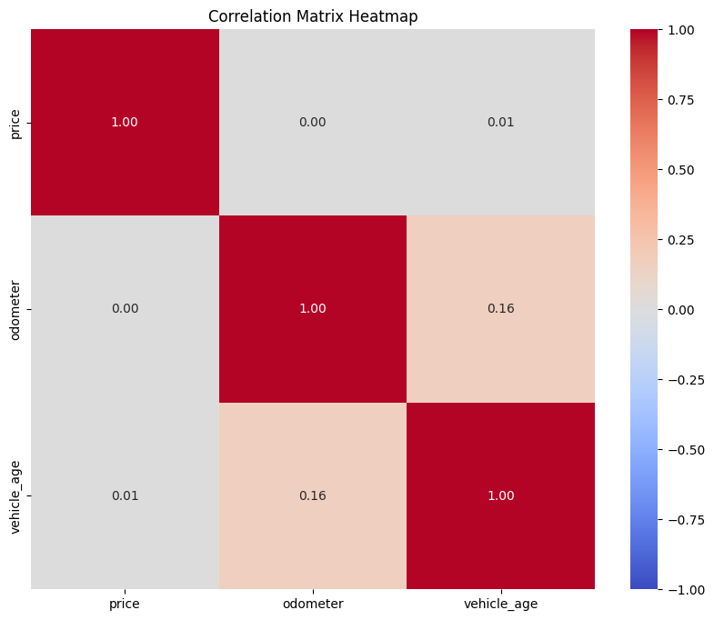

4. IQR Outlier Filtration

- Scans feature distribution spaces across price, odometer, and vehicle_age.
- Drops out-of-bounds records to optimize model stability.

- Generates a scatter plot mapping structural boundaries.

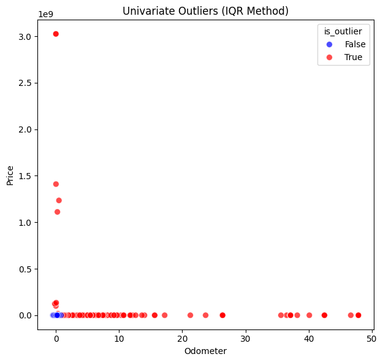

5. Cross-Validation & Polynomial Tuning

- Splits the historical log dataset into an 80/20 train/test matrix.

- Tests polynomial features ranging from degrees 1 through 10.

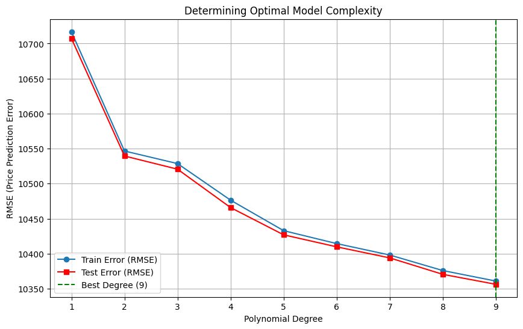

- Logs performance using a 5-fold cross-validation Mean Squared Error (MSE) script.

- Plots train vs. validation curve configurations over a logarithmic scale.

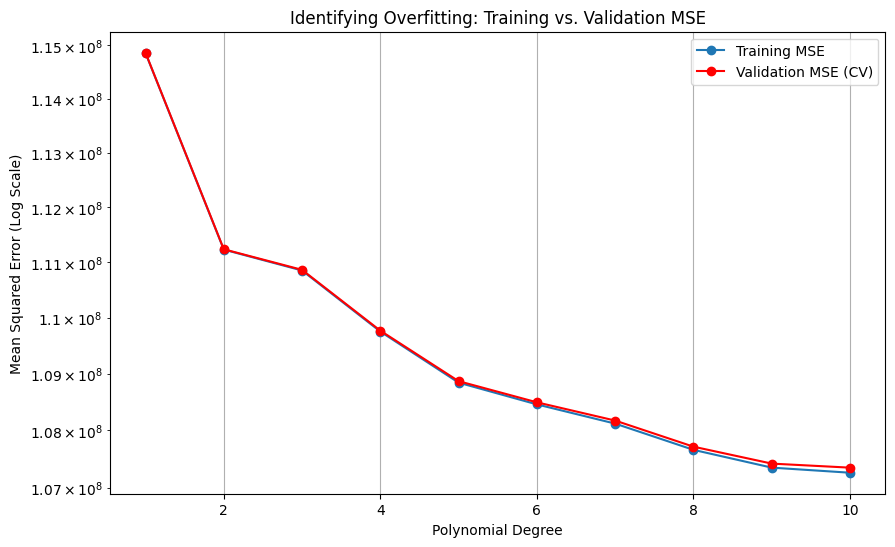

6. Regularization & Hyperparameter Search

- Loops through L2 regularization strengths (alphas = [0.001, 0.1, 1.0, 10.0, 100.0]) via a Ridge estimator.

- Plots Mean Squared Error (MSE) metrics against penalty parameters to lock down the optimal mathematical trade-off.

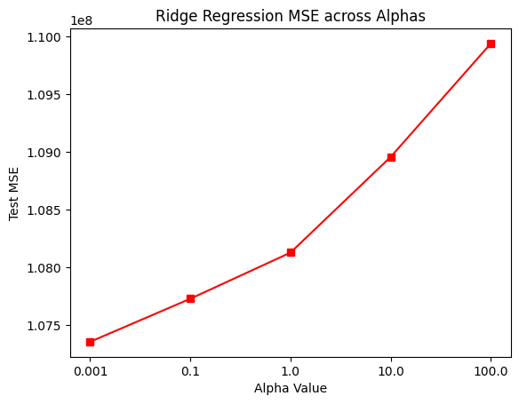

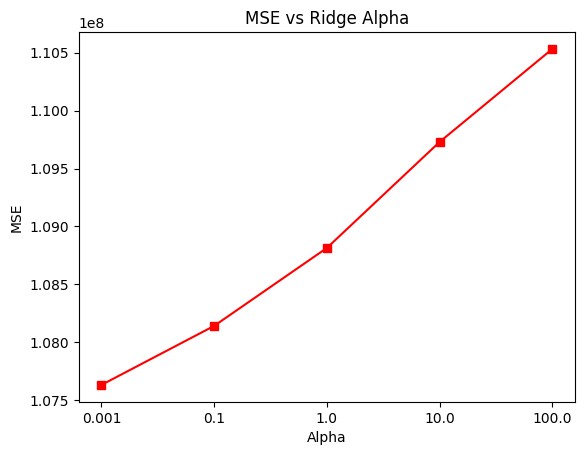

7. Incremental Feature Expansion

The pipeline scales model performance up by sequentially encoding and testing new feature combinations in a machine learning Pipeline:

	**Iteration 1**: Base numerical attributes (vehicle_age + odometer).
	
	**Iteration 2**: Adds vehicle wear metrics ('condition_encoded').

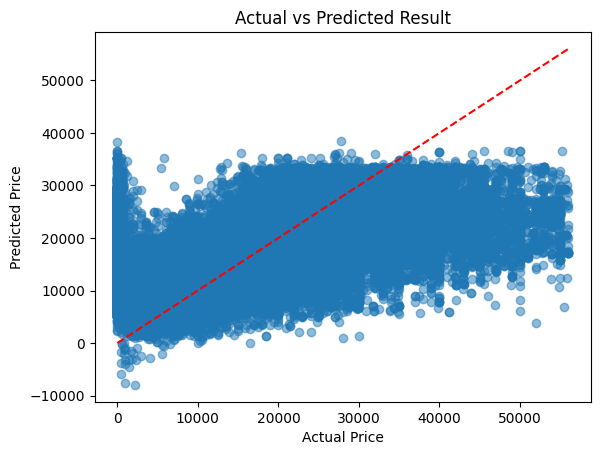

	
	**Iteration 3**: Adds brand presence indicators ('manufacturer_encoded').

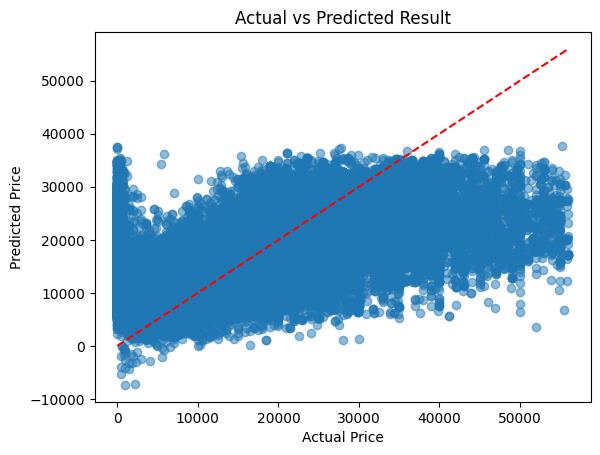

	**Iteration 4**: Adds structural body design classes ('type_encoded').

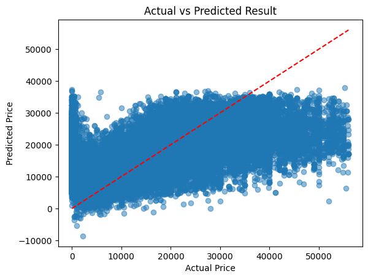

	**Iteration 5**: Final evaluation of different Ridge alpha values to obtain the best alpha for the model using all features above (vehicle_age + odometer + condition_encoded + manufacturer_encoded + type_encoded), including 5k cross validation procedure.

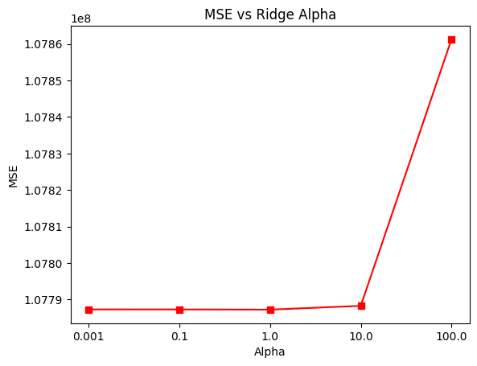

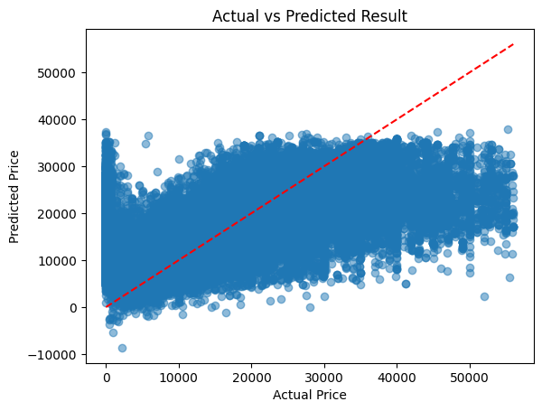

📊 Evaluation Visualizations

The script automatically produces four critical diagnostic plots:

1.  **Correlation Heatmap**: Visualizes feature interactions and highlights the column with the highest direct linear relationship to 'price'.

2.  **Complexity Graph**: Plots Training vs. Validation MSE across polynomial degrees to pinpoint the optimal degree.

3.  **Alpha Shrinkage Chart**: Visualizes model test error variations across regularized weight thresholds.

4.  **Actual vs. Predicted Scatter Plot**: Draws a diagonal identity line ('y = x') against final predictions to display accuracy spreads.

💻 How to Run

1. Create a root directory named 'data' and store your dataset inside it as 'vehicles.csv'.

2. Open the file in Google Colab or your local Jupyter notebook server.

3. Execute all code cells sequentially to process data, view evaluations, and evaluate final predictive scores.